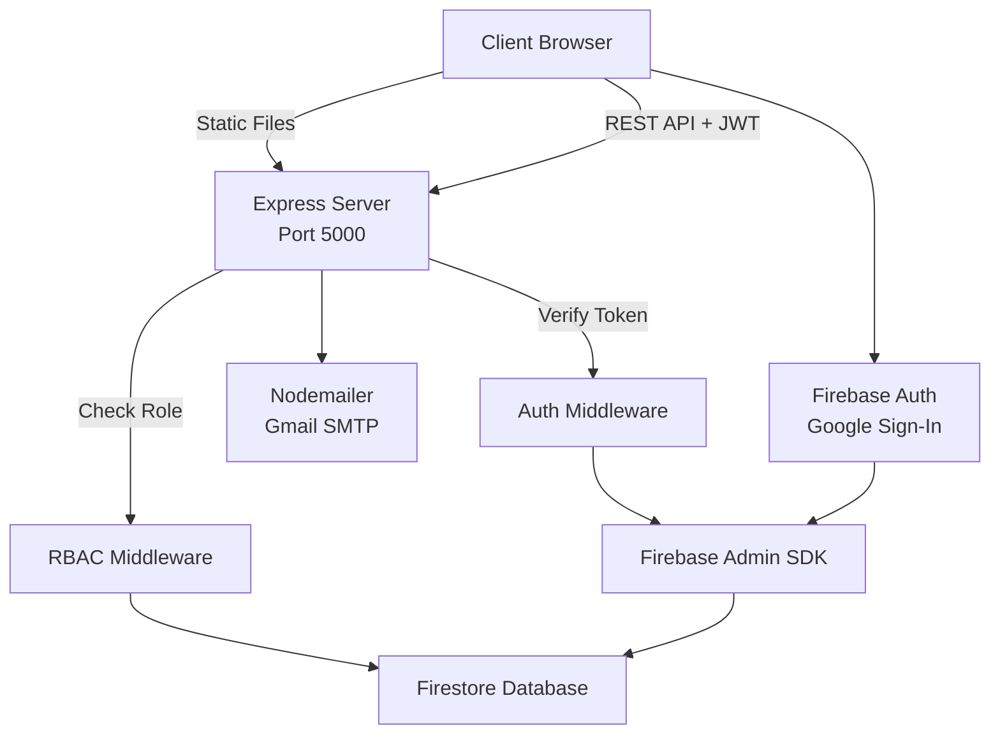

# 📚 ResourceHub — Library & Lab Equipment Booking System

> **Repository:** [github.com/Sarthak003khurana/library-management-system](https://github.com/Sarthak003khurana/library-management-system)

---

## Table of Contents

1. [Project Introduction](#1-project-introduction)
2. [Features](#2-features)
3. [User Dashboard](#3-user-dashboard)
4. [Library Catalog](#4-library-catalog)
5. [Book Management](#5-book-management)
6. [Quantity / Inventory System](#6-quantity--inventory-system)
7. [CSV Bulk Import](#7-csv-bulk-import)
8. [ISBN Autofill](#8-isbn-autofill)
9. [Equipment Management](#9-equipment-management)
10. [Reservations](#10-reservations)
11. [Waitlist](#11-waitlist)
12. [Fines](#12-fines)
13. [Return System](#13-return-system)
14. [Reliability Score](#14-reliability-score)
15. [Admin User Management](#15-admin-user-management)
16. [Email System](#16-email-system)
17. [Firebase](#17-firebase)
18. [Database](#18-database)
19. [Architecture](#19-architecture)
20. [Technology Stack](#20-technology-stack)
21. [Project Structure](#21-complete-project-structure)
22. [Installation](#22-installation)
23. [Package.json Commands](#23-packagejson-commands)
24. [Environment Variables](#24-environment-variables)
25. [Firebase Setup](#25-firebase-setup)
26. [Gmail Setup](#26-gmail-setup)
27. [Running the Project](#27-running-the-project)
28. [API Documentation](#28-api-documentation)
29. [Role Permission Matrix](#29-role-permission-matrix)
30. [User Guide](#30-user-guide)
31. [Admin Guide](#31-admin-guide)
32. [Security](#32-security)
33. [Troubleshooting](#33-troubleshooting)
34. [Git / GitHub](#34-git--github)
35. [Development Guide](#35-development-guide)
36. [Current Limitations](#36-current-limitations)
37. [Future Improvements](#37-future-improvements)
38. [License](#38-license)
39. [Author](#39-author)

---

## 1. Project Introduction

**ResourceHub** is a full-stack, role-based Library & Lab Equipment Booking System. It was developed as a comprehensive demonstration of a 30-point JavaScript curriculum, covering everything from variables and data types to async/await, Fetch API, and full project integration.

The system solves the real-world problem of managing both traditional library books and time-sensitive lab equipment reservations in a single unified platform. It serves university students, faculty, lab managers, and administrators with differentiated permissions and workflows.

### What It Manages

- **Books** — Multiple-copy inventory with quantity tracking, 14-day loans, and late fees
- **Lab Equipment** — Visual 14-day timeline booking with conflict detection
- **Users** — Admin-created accounts with role assignment and temporary passwords
- **Fines** — Automatic late-fee and condition-damage calculation
- **Waitlist** — Transparent priority queue when resources are unavailable

### High-Level Workflow

```
┌─────────────┐     ┌─────────────┐     ┌─────────────────┐
│   Login     │────▶│  Dashboard  │────▶│  Browse Catalog │
│ (JWT/Firebase)     │ (Overview)  │     │  (Search/Filter)│
└─────────────┘     └─────────────┘     └─────────────────┘
                                                │
                    ┌───────────────────────────┼───────────────────────────┐
                    ▼                           ▼                           ▼
              ┌─────────┐               ┌─────────────┐               ┌──────────┐
              │ Borrow  │               │ Book Equipment│              │ Waitlist │
              │ (Book)  │               │ (Timeline)   │              │ (Queue)  │
              └────┬────┘               └──────┬──────┘              └────┬─────┘
                   │                            │                          │
                   ▼                            ▼                          ▼
              ┌─────────┐               ┌─────────────┐               ┌──────────┐
              │  Return │               │   Return    │               │ Notify   │
              │ + Fine  │               │  + Fine     │               │ (Manual) │
              └─────────┘               └─────────────┘               └──────────┘
```

---

## 2. Features

### Authentication
- **Email/Password Login** — Standard JWT-based authentication
- **Google Login** — Firebase Authentication popup; account must be pre-registered by admin
- **Firebase Authentication** — Frontend uses Firebase Auth SDK for Google sign-in
- **JWT Authentication** — Backend issues 7-day JWT tokens for session management
- **Logout** — Clears both Firebase session and local application token
- **Temporary Passwords** — Auto-generated on admin user creation; must be changed on first login
- **Forced Password Change** — `mustChangePassword` flag blocks access until password is updated
- **Password Change** — Users can change passwords with current password verification

### User Roles
The system has **four confirmed roles**:

| Role | Description |
|------|-------------|
| `student` | Can browse, borrow, book equipment, view waitlist, and pay fines |
| `faculty` | Same permissions as student |
| `admin` | Full access: analytics, item CRUD, user management, all user features |
| `lab_manager` | Can manage items, view analytics, and use all user features; **cannot** manage users |

### Catalog & Search
- Browse mixed books and equipment
- Search by title, author, category, or ISBN
- Filter by type (book/equipment) and category
- Real-time result count

### Borrowing & Booking
- **Books** — 14-day automatic loan period; quantity-aware availability
- **Equipment** — Custom date-range booking with server-side conflict detection (409 on overlap)

### Returns
- Condition rating (1–10 scale)
- Optional damage description
- Automatic late fee + condition-damage fine calculation
- Reliability score update

### Waitlist
- Priority score algorithm (transparent breakdown shown in UI)
- Queue position per item
- Cancel own waitlist entry

### Fines
- View all fines with reason, amount, and date
- Pay outstanding fines (marks as paid; no payment gateway)

### Admin Analytics
- Most borrowed items (bar chart)
- Category usage (doughnut chart)
- Overdue trend — last 6 weeks (line chart)
- Total items, reservations, overdue count, fines collected

### Item Management
- Add/edit/delete items
- ISBN autofill via Open Library API
- CSV bulk import with smart duplicate handling and quantity aggregation
- Quantity management (total vs. available copies)

---

## 3. User Dashboard

The personal dashboard (`/`) displays:

| Section | Description |
|---------|-------------|
| **Welcome Header** | Personalized greeting with reliability score badge |
| **Stat Cards** | Currently Borrowed · Waitlist Entries · Fines Due · Reliability Score |
| **Quick Actions** | Browse Catalog · Book Equipment · View Waitlist · Pay Fines |
| **Recent Activity** | Last 5 reservations with status (active/completed) |
| **Due Soon** | Up to 5 active reservations sorted by days remaining; shows OVERDUE, "X days left", and Return button |

---

## 4. Library Catalog

### Browse Resources
- Grid layout with cover image (or type icon), title, author, category, location, and fine rate
- Type badge (📚 Book / 🔬 Equipment) and status badge (Available / Maintenance / Borrowed)

### Search
- Real-time search across **title**, **author**, **category**, and **ISBN**
- Keyboard shortcut: `Ctrl + K` focuses the search field

### Filtering
- **Type filter**: All / Books / Equipment
- **Category filter**: Dynamically populated from all existing categories
- **Clear filters** button appears when any filter is active

### Borrowing
- **Books**: "Borrow Now" button when `availableQuantity > 0`
- **Unavailable books**: "Join Waitlist" button
- **Equipment**: "View Availability" links to timeline

---

## 5. Book Management

### Adding Items (Admin/Lab Manager)

Required fields:
- `title` — Resource name
- `type` — `book` or `equipment`
- `category` — Subject or lab category

Optional fields:
- `location` — Defaults to "Unassigned"
- `finePerDay` — Defaults to ₹3 for books, ₹10 for equipment
- `isbn` — For books; used for lookup and duplicate detection
- `author` — For books
- `coverUrl` — Cover image URL
- `quantity` — Total copies; defaults to 1, minimum 1

### Editing Items
All fields editable including quantity. The system prevents reducing total quantity below the number of currently borrowed copies.

### Deleting Items
Permanent removal from Firestore. No cascade delete on reservations (orphaned reservations may reference deleted items).

---

## 6. Quantity / Inventory System

This is a core feature for **books only**. Equipment is treated as single-unit items.

### Definitions

| Field | Meaning |
|-------|---------|
| `quantity` | Total physical copies owned by the library |
| `availableQuantity` | Copies not currently borrowed |

### Example Lifecycle

```
Step 1: Add book with quantity = 10
  quantity: 10
  availableQuantity: 10
  status: available

Step 2: Student A borrows 1 copy
  quantity: 10
  availableQuantity: 9
  status: available

Step 3: Student B borrows 1 copy
  quantity: 10
  availableQuantity: 8
  status: available

Step 4: All 10 copies borrowed
  quantity: 10
  availableQuantity: 0
  status: borrowed

Step 5: Student A returns
  quantity: 10
  availableQuantity: 1
  status: available
```

### Admin Quantity Changes

When editing an item, the admin can change `quantity`. The system:

1. Calculates `borrowedCopies = oldTotal - oldAvailable`
2. Sets `newAvailable = newTotal - borrowedCopies`
3. **Rejects** the update if `newTotal < borrowedCopies` with error:  
   `"Cannot reduce total quantity below X currently borrowed copies"`

### Concurrency Protection

Book borrow and return operations use **Firestore transactions** to prevent race conditions when two users attempt to borrow the last available copy simultaneously.

- Borrow: Reads latest `availableQuantity` inside transaction; rejects if 0
- Return: Reads latest `availableQuantity` inside transaction; increments by 1 (capped at `quantity`)

---

## 7. CSV Bulk Import

### Supported Columns

| Column | Required | Default |
|--------|----------|---------|
| `title` | ✅ | — |
| `author` | ❌ | `null` |
| `category` | ❌ | `"General"` |
| `location` | ❌ | `"Unassigned"` |
| `finePerDay` | ❌ | `3` (book) / `10` (equipment) |
| `isbn` | ❌ | `null` |
| `quantity` | ❌ | `1` |

### Duplicate Handling

1. **If ISBN exists**: ISBN is used as the identity key
2. **If no ISBN**: Normalized title is used as the identity key
3. **Duplicate rows**: Quantities are **added together**
4. **Missing info**: The first non-empty value for `author`, `category`, `location`, or `isbn` is retained

### Example CSV

```csv
title,author,category,location,finePerDay,isbn,quantity
Clean Code,Robert C. Martin,Software Engineering,Shelf B-12,2,9780132350884,5
Introduction to Algorithms,Cormen et al.,Computer Science,Shelf A-04,2,9780262033848,3
Digital Oscilloscope,,Electronics Lab,Lab 3 - Bench 2,10,,1
Arduino Starter Kit,,Electronics Lab,Lab 3 - Cabinet 1,5,,2
```

If the `quantity` column is missing, every unique book gets `quantity = 1`.

### Error Handling
- Empty or invalid rows are skipped
- `title` is required per row; rows without titles are discarded
- Invalid quantity values fall back to 1
- Import is committed as a Firestore batch (all-or-nothing per unique item group)

---

## 8. ISBN Autofill

### How It Works

1. Admin enters an ISBN in the "Add Resource" modal
2. Clicks **Autofill** button
3. Backend queries the **Open Library API**:

```
GET https://openlibrary.org/api/books?bibkeys=ISBN:{isbn}&format=json&jscmd=data
```

### Retrieved Fields
- `title` — Book title
- `author` — Concatenated author names
- `coverUrl` — Medium cover image URL

### Fallback
If Open Library returns no data or the request fails, the admin sees an error message and must enter details manually.

---

## 9. Equipment Management

### Equipment Resources
- Type: `equipment`
- No quantity system (treated as single unit)
- Status: `available` or `maintenance`

### Booking
- Admin/Lab Manager adds equipment with location and daily fine
- Users navigate to **Booking Timeline** (`/timeline`)

### Timeline UI
- **14-day horizontal calendar** with one column per day
- **Rows**: One per equipment item (sticky left column)
- **Cell colors**:
  - 🟢 Green = Available (clickable)
  - 🔵 Blue = Your booking
  - ⚫ Gray = Booked by others
  - 🔴 Red = Overdue booking

### Conflicting Bookings
Server-side overlap detection using date-range comparison. If a new booking overlaps with any `active` reservation for the same item, the API returns `409 Conflict` with message:  
`"This time slot conflicts with an existing booking"`

### Booking Status
- `active` — Currently reserved
- `completed` — Returned
- `cancelled` — Cancelled by user or admin

---

## 10. Reservations

### Complete Lifecycle

```
Browse Catalog / Timeline
         │
         ▼
   Check Availability
         │
    ┌────┴────┐
    ▼         ▼
  Book     No Copies
  Available  │
    │        ▼
    │    Join Waitlist
    ▼
Create Reservation
    │
    ▼
Active Reservation
    │
    ▼
   Return
    │
    ▼
Condition Assessment
    │
    ▼
Fine Calculation
    │
    ▼
Reservation Completed
```

### Cancellation
- Users can cancel their own active reservations
- Admin/Lab Manager can cancel any reservation
- **Books**: Cancellation restores `availableQuantity` via Firestore transaction
- **Equipment**: Cancellation updates status only (no quantity to restore)

---

## 11. Waitlist

### Joining
- From the catalog, click **Join Waitlist** on unavailable books
- Urgency level: currently hardcoded to `'normal'` in the frontend

### Priority Algorithm

Score = weighted blend of four components:

| Component | Weight | Source |
|-----------|--------|--------|
| Role | 30% | `admin:100`, `lab_manager:90`, `faculty:80`, `student:50` |
| Reliability | 40% | User's `reliabilityScore` (0–100) |
| Urgency | 20% | `critical:100`, `high:70`, `normal:40` |
| Time Waited | 10% | Hours waiting × 0.5 (capped at 100) |

### Queue Position
- Position is calculated **per item** (independent queues per book)
- Position `#1` = next in line when a copy becomes available

### Cancellation
- Users can cancel their own waitlist entries
- Admin/Lab Manager can delete any entry

> **Note:** There is no automatic notification when a book becomes available. Users must check the catalog or waitlist manually.

---

## 12. Fines

### Fine Calculation

**Late Fee:**
- `graceDays = 1` (1-day grace period)
- `dailyRate = item.finePerDay`
- `cap = finePerDay × 25` (maximum fine per reservation)
- Formula: `max(0, daysLate - 1) × dailyRate`, capped at 25× rate

**Condition Damage Fee:**
- `penaltyPerPoint = 5`
- Formula: `max(0, conditionBefore - conditionAfter) × 5`

**Total Fine:** `lateFee + conditionFine`

### Current Rates
- Book default fine: **₹3/day**
- Equipment default fine: **₹10/day**

### Fine Records
Stored in the `fines` collection with:
- `userId`, `reservationId`, `itemTitle`
- `amount`, `reason` ("Late return", "Condition damage", or combined)
- `paid` boolean, `createdAt` timestamp

### Payment
- **No payment gateway** is integrated
- "Pay Now" button marks the fine as `paid: true` with a `paidAt` timestamp
- Admin/Lab Manager can also mark fines as paid on behalf of users

---

## 13. Return System

### Return Workflow

1. User clicks **Return** on dashboard "Due Soon" section
2. Modal opens with:
   - **Condition Rating** slider (1–10, default 9)
   - **Damage Description** textarea (optional)
3. User clicks **Confirm Return**
4. Backend processes:
   - Calculates late fee (if overdue)
   - Calculates condition fine (if rating dropped)
   - Creates fine record if `totalFine > 0`
   - Updates reservation status to `completed`
   - Restores book `availableQuantity` (transaction)
   - Updates item `conditionRating`
   - Updates user `reliabilityScore`

---

## 14. Reliability Score

### Initial Value
- New users: **75** (set on admin creation)

### Score Changes

| Action | Delta |
|--------|-------|
| Return with no fine | **+2** |
| Return with any fine | **-5** |

### Constraints
- Score is clamped between **0** and **100**
- Affects waitlist priority (40% weight)

---

## 15. Admin User Management

### Creating Users
- **Admin only** (`POST /api/auth/admin/create-user`)
- Form fields: Full Name, Email, Role
- System generates a **temporary password** (9 random bytes, base64url)
- Password is **bcrypt-hashed** and stored; plain text is shown once in the UI
- Account creation email is sent via Gmail

### Email Notification
- HTML + plain text email with login URL, credentials, and temporary password warning
- If email fails, user is still created; admin sees the password in the UI

### User List
- Table shows: Name, Email, Role, Password Status, Reliability Score
- Password Status: "Temporary password" (amber) or "Password changed" (green)

### Deleting Users
- Admin can delete any user **except themselves**
- Deletes from Firestore only; does not clean up associated reservations or fines

---

## 16. Email System

### Provider
- **Gmail** via **Nodemailer**

### Required Configuration

| Variable | Purpose |
|----------|---------|
| `EMAIL_USER` | Gmail address for notifications |
| `EMAIL_APP_PASSWORD` | Gmail App Password (NOT your normal password) |

### Why App Password?
Gmail requires 2-Step Verification + an App Password for "less secure apps" access. Using your normal Gmail password will result in an authentication error.

### Sent Emails
- **Account Creation Email** — Sent when admin creates a user; contains temporary password and login link

### Troubleshooting Gmail

| Error | Cause | Fix |
|-------|-------|-----|
| `535-5.7.8 Username and Password not accepted` | Using normal password instead of App Password | Generate App Password in Google Account settings |
| `Email service is not configured` | Missing `EMAIL_USER` or `EMAIL_APP_PASSWORD` | Add both to `.env` and restart |
| `Invalid login` | 2-Step Verification not enabled | Enable 2-Step Verification first |

---

## 17. Firebase

### Firebase Authentication (Frontend)
- Used for **Google Sign-In** only
- Firebase config is **hardcoded in `client/index.html`**
- Initializes `firebaseApp` and `firebaseAuth` on the `window` object

### Google Authentication Flow
1. Frontend opens Firebase Google popup (`signInWithPopup`)
2. User grants permission
3. Frontend retrieves Firebase ID token
4. Token sent to backend `POST /api/auth/google`
5. Backend verifies token with Firebase Admin SDK
6. Backend finds matching user by `firebaseUid` or email
7. If found, links Firebase account and issues application JWT
8. If **not found**, returns `403`: "This Google account has not been registered by an administrator"

### Firebase Admin SDK (Backend)
- Initializes from `server/firebase.js`
- Reads service account from `firebase-service-account.json`
- Used for:
  - Verifying Google ID tokens
  - Accessing Firestore database

### Firestore
- Primary database for the application
- All CRUD operations go through Firestore
- The old `server/data/db.json` local file is **not used by the running application** (only by `npm run seed` for generating demo data locally)

---

## 18. Database

### Firestore Collections

#### `users`
Stores all registered users.

| Field | Type | Description |
|-------|------|-------------|
| `id` | string | UUID |
| `name` | string | Full name |
| `email` | string | Normalized email |
| `password` | string | bcrypt hash |
| `role` | string | `student` / `faculty` / `admin` / `lab_manager` |
| `reliabilityScore` | number | 0–100 |
| `authProvider` | string | `password` or `google` |
| `firebaseUid` | string | Linked Firebase UID (optional) |
| `mustChangePassword` | boolean | Force password change flag |
| `createdAt` | string | ISO timestamp |

#### `items`
Books and equipment.

| Field | Type | Description |
|-------|------|-------------|
| `id` | string | UUID |
| `title` | string | Resource name |
| `type` | string | `book` or `equipment` |
| `category` | string | Subject/lab category |
| `status` | string | `available` / `borrowed` / `maintenance` |
| `location` | string | Physical location |
| `finePerDay` | number | Late fee rate |
| `isbn` | string | ISBN (books only) |
| `author` | string | Author (books only) |
| `coverUrl` | string | Cover image URL |
| `quantity` | number | Total copies (books) |
| `availableQuantity` | number | Available copies (books) |
| `conditionRating` | number | 1–10 condition score |
| `createdAt` | string | ISO timestamp |

#### `reservations`
Borrowing and booking records.

| Field | Type | Description |
|-------|------|-------------|
| `id` | string | UUID |
| `itemId` | string | Reference to item |
| `userId` | string | Reference to user |
| `userName` | string | Borrower name |
| `itemType` | string | `book` or `equipment` |
| `startDate` | string | ISO timestamp |
| `endDate` | string | ISO timestamp |
| `dueDate` | string | ISO timestamp (same as endDate for books) |
| `borrowedAt` | string | ISO timestamp |
| `returnedAt` | string | ISO timestamp or `null` |
| `status` | string | `active` / `completed` / `cancelled` |
| `conditionBefore` | number | Rating at borrow |
| `conditionAfter` | number | Rating at return |
| `fineCalculated` | number | Total fine |
| `damageDescription` | string | Optional damage notes |

#### `waitlist`
Priority queue entries.

| Field | Type | Description |
|-------|------|-------------|
| `id` | string | UUID |
| `itemId` | string | Reference to item |
| `userId` | string | Reference to user |
| `urgency` | string | `normal` / `high` / `critical` |
| `requestedAt` | string | ISO timestamp |
| `notified` | boolean | Notification flag (unused) |

#### `fines`
Fine records.

| Field | Type | Description |
|-------|------|-------------|
| `id` | string | UUID |
| `userId` | string | Reference to user |
| `reservationId` | string | Reference to reservation |
| `itemTitle` | string | Item name |
| `amount` | number | Fine amount |
| `reason` | string | `Late return` / `Condition damage` / combined |
| `paid` | boolean | Payment status |
| `createdAt` | string | ISO timestamp |
| `paidAt` | string | ISO timestamp (optional) |

---

## 19. Architecture



### Layer Explanation

| Layer | Technology | Role |
|-------|-----------|------|
| **Frontend** | Vanilla JS, Tailwind CSS, Chart.js | SPA with client-side routing |
| **Backend** | Express.js | REST API, static file serving |
| **Auth** | JWT + Firebase Auth | Token verification, Google login |
| **Database** | Firebase Firestore | Document store for all entities |
| **Email** | Nodemailer + Gmail | Account creation notifications |
| **External API** | Open Library API | ISBN metadata lookup |

---

## 20. Technology Stack

### Frontend
| Technology | Role |
|------------|------|
| Vanilla JavaScript (ES6+) | Application logic, routing, DOM manipulation |
| Tailwind CSS (CDN) | Utility-first styling |
| Chart.js (CDN) | Admin analytics charts |
| Firebase Auth SDK (CDN) | Google authentication |

### Backend
| Technology | Role |
|------------|------|
| Node.js | Runtime |
| Express.js | Web framework, REST API |
| bcryptjs | Password hashing |
| jsonwebtoken | JWT generation and verification |
| dotenv | Environment variable loading |
| nodemailer | Email delivery |

### Database
| Technology | Role |
|------------|------|
| Firebase Firestore | NoSQL document database |
| Firebase Admin SDK | Server-side Firestore access |

### External Services
| Technology | Role |
|------------|------|
| Open Library API | ISBN book metadata lookup |
| Gmail SMTP | Transactional emails |

### Tools
| Technology | Role |
|------------|------|
| npm | Package management |
| Node.js `--watch` | Development auto-reload (`npm run dev`) |

---

## 21. Complete Project Structure

```
library-management-system/
├── package.json
├── .gitignore
├── server/
│   ├── server.js              # Express entry point, API + static files
│   ├── db.js                  # Firestore wrapper (async collection API)
│   ├── firebase.js            # Firebase Admin SDK initialization
│   ├── data/
│   │   └── seed.js            # Demo data generator (writes local JSON)
│   ├── middleware/
│   │   ├── auth.js            # JWT verification + role middleware
│   │   └── rbac.js            # Role-based access control helper
│   ├── routes/
│   │   ├── auth.js            # Login, Google auth, user CRUD
│   │   ├── items.js           # Item CRUD, ISBN lookup, CSV import
│   │   ├── reservations.js    # Borrow, return, cancel
│   │   ├── waitlist.js        # Waitlist CRUD
│   │   ├── fines.js           # Fine viewing and payment
│   │   └── analytics.js       # Admin dashboard aggregates
│   └── utils/
│       ├── priorityAlgorithm.js  # Waitlist scoring formula
│       ├── fineCalculator.js     # Late fee + condition damage math
│       └── email.js              # Nodemailer account creation emails
├── client/
│   ├── index.html             # Single-page app shell
│   ├── css/
│   │   └── styles.css         # Tactile UI design system
│   └── js/
│       ├── app.js             # Router, RBAC navigation, layout
│       ├── auth.js            # Authentication helpers
│       ├── api.js             # Fetch wrapper with JWT
│       ├── storage.js         # localStorage wrapper
│       ├── components.js      # Sidebar, cards, toasts, modal, auth form
│       ├── dashboard.js       # Personal overview + return flow
│       ├── catalog.js         # Browse/search/filter/borrow
│       ├── timeline.js        # Equipment 14-day booking calendar
│       ├── waitlist.js        # Priority waitlist view
│       ├── fines.js           # Fines & payment UI
│       ├── adminDashboard.js  # Analytics charts + user management
│       ├── adminItems.js      # Item CRUD, ISBN autofill, CSV import
│       └── adminUsers.js      # User management page
└── firebase-service-account.json   # Firebase Admin credentials (not in repo)
```

---

## 22. Installation

### Prerequisites
- **Node.js** ≥ 18.0.0
- **npm** (bundled with Node.js)
- A **Firebase project** with Firestore enabled
- A **Gmail account** with App Password (for email notifications)

### Step-by-Step Setup

```bash
# 1. Clone the repository
git clone https://github.com/Sarthak003khurana/library-management-system.git

# 2. Enter the project directory
cd library-management-system

# 3. Install dependencies
npm install

# 4. Create environment file
cp .env.example .env
# (If .env.example does not exist, create .env manually — see Environment Variables section)

# 5. Configure Firebase (see Firebase Setup section)

# 6. Configure Gmail (see Gmail Setup section)

# 7. Start the server
npm start
```

The application will be available at **http://localhost:5000**.

---

## 23. package.json Commands

| Command | Description |
|---------|-------------|
| `npm start` | Starts the production server (`node server/server.js`) |
| `npm run dev` | Starts with auto-reload on file changes (`node --watch server/server.js`) |
| `npm run seed` | Generates demo data to `server/data/db.json` (local file only; does NOT seed Firestore) |

> **Note:** `npm run seed` writes to a local JSON file for reference. It does **not** populate Firestore. To add demo data to Firestore, use the admin dashboard or the bulk import feature.

---

## 24. Environment Variables

Create a `.env` file in the project root:

| Variable | Required | Purpose | Example |
|----------|----------|---------|---------|
| `PORT` | No | Server port | `5000` |
| `JWT_SECRET` | No | JWT signing secret | `your-super-secret-key` |
| `EMAIL_USER` | No* | Gmail address for notifications | `yourlib@gmail.com` |
| `EMAIL_APP_PASSWORD` | No* | Gmail App Password | `abcd efgh ijkl mnop` |
| `APP_LOGIN_URL` | No | Login URL in account emails | `http://localhost:5000` |

\* Required only if you want account creation emails to be sent.

> **Security:** Never commit `.env` or `firebase-service-account.json` to Git. Both are listed in `.gitignore`.

---

## 25. Firebase Setup

### 1. Create a Firebase Project
1. Go to [Firebase Console](https://console.firebase.google.com/)
2. Click **Add project** and follow the setup wizard

### 2. Enable Authentication
1. In Firebase Console, go to **Build → Authentication**
2. Click **Get started**
3. Enable **Google** sign-in provider:
   - Click **Google**
   - Toggle **Enable**
   - Add a support email
   - Click **Save**

### 3. Create Firestore Database
1. Go to **Build → Firestore Database**
2. Click **Create database**
3. Choose **Start in test mode** (or production mode with appropriate rules)
4. Select a region close to your users

### 4. Create Firebase Admin Service Account
1. Go to **Project settings → Service accounts**
2. Click **Generate new private key**
3. Download the JSON file

### 5. Place Service Account
Move the downloaded JSON file to the project root and rename it to:

```
firebase-service-account.json
```

### 6. Frontend Firebase Config
The Firebase client configuration is **hardcoded in `client/index.html`**. If you create your own Firebase project, update the `firebaseConfig` object in `index.html` with your project's values (found in Firebase Console → Project settings → General → Your apps).

---

## 26. Gmail Setup

1. **Create or use an existing Gmail account**
2. **Enable 2-Step Verification**:
   - Google Account → Security → 2-Step Verification → Turn on
3. **Generate an App Password**:
   - Google Account → Security → 2-Step Verification → App passwords
   - Select **Mail** → **Other (Custom name)** → Type "ResourceHub"
   - Click **Generate** — copy the 16-character password
4. **Add to `.env`**:

```env
EMAIL_USER=yourgmail@gmail.com
EMAIL_APP_PASSWORD=abcd efgh ijkl mnop
```

5. **Restart the server**

> **Important:** Do NOT use your normal Gmail password. Use the App Password only.

---

## 27. Running the Project

### Development Mode
```bash
npm run dev
```
- Auto-restarts server on file changes
- Access at `http://localhost:5000`

### Production Mode
```bash
npm start
```
- Standard Node.js execution
- Access at `http://localhost:5000` (or your configured `PORT`)

### What Starts
- **Backend**: Express server on the configured port
- **Frontend**: Static files served from `client/` directory
- **API**: All routes prefixed with `/api`

### Demo Accounts
If you manually create these users in Firestore (passwords are bcrypt hashes of `password123`):

| Email | Role | Password |
|-------|------|----------|
| `alice@uni.edu` | student | `password123` |
| `bob@uni.edu` | faculty | `password123` |
| `carol@uni.edu` | admin | `password123` |
| `dave@uni.edu` | lab_manager | `password123` |

---

## 28. API Documentation

### Authentication

| Method | Endpoint | Auth | Role | Body | Response | Purpose |
|--------|----------|------|------|------|----------|---------|
| `POST` | `/api/auth/login` | No | Any | `{ email, password }` | `{ token, user, mustChangePassword }` | Email/password login |
| `POST` | `/api/auth/google` | No | Any | `{ firebaseToken }` | `{ token, user, mustChangePassword }` | Google login |
| `POST` | `/api/auth/change-password` | Yes | Any | `{ currentPassword, newPassword }` | `{ message, token, user }` | Change password |
| `GET` | `/api/auth/me` | Yes | Any | — | User object | Get current user |
| `POST` | `/api/auth/admin/create-user` | Yes | `admin` | `{ name, email, role }` | `{ message, user, temporaryPassword }` | Create user |
| `GET` | `/api/auth/users` | Yes | `admin` | — | User[] | List all users |
| `DELETE` | `/api/auth/users/:id` | Yes | `admin` | — | `{ message, deletedUser }` | Delete user |

### Items

| Method | Endpoint | Auth | Role | Body | Response | Purpose |
|--------|----------|------|------|------|----------|---------|
| `GET` | `/api/items` | Yes | Any | Query: `?type=&category=&status=&q=` | Item[] | List/filter items |
| `GET` | `/api/items/:id` | Yes | Any | — | Item | Get single item |
| `GET` | `/api/items/lookup/isbn/:isbn` | Yes | `admin`/`lab_manager` | — | `{ title, author, coverUrl, isbn }` | ISBN lookup |
| `POST` | `/api/items` | Yes | `admin`/`lab_manager` | `{ title, type, category, location, finePerDay, isbn, author, coverUrl, quantity }` | Item | Create item |
| `PUT` | `/api/items/:id` | Yes | `admin`/`lab_manager` | `{ title, type, category, location, finePerDay, isbn, author, coverUrl, quantity, status }` | Item | Update item |
| `DELETE` | `/api/items/:id` | Yes | `admin`/`lab_manager` | — | `204 No Content` | Delete item |
| `POST` | `/api/items/bulk-import` | Yes | `admin`/`lab_manager` | `{ items: [{ title, author, category, location, finePerDay, isbn, quantity }] }` | `{ importedCount, items }` | CSV bulk import |

### Reservations

| Method | Endpoint | Auth | Role | Body | Response | Purpose |
|--------|----------|------|------|------|----------|---------|
| `GET` | `/api/reservations` | Yes | Any | Query: `?all=true` (admin/lab_manager only) | Reservation[] | List reservations |
| `POST` | `/api/reservations` | Yes | Any | `{ itemId, startDate?, endDate? }` | Reservation | Create reservation |
| `POST` | `/api/reservations/:id/return` | Yes | Any | `{ conditionRating?, damageDescription? }` | `{ message, lateFee, conditionFine, totalFine, quantity, availableQuantity }` | Return item |
| `POST` | `/api/reservations/:id/cancel` | Yes | Any | — | `{ message }` | Cancel reservation |

### Waitlist

| Method | Endpoint | Auth | Role | Body | Response | Purpose |
|--------|----------|------|------|------|----------|---------|
| `GET` | `/api/waitlist` | Yes | Any | — | WaitlistEntry[] | List waitlist (sorted by priority) |
| `POST` | `/api/waitlist` | Yes | Any | `{ itemId, urgency? }` | WaitlistEntry | Join waitlist |
| `DELETE` | `/api/waitlist/:id` | Yes | Any | — | `204 No Content` | Leave waitlist |

### Fines

| Method | Endpoint | Auth | Role | Body | Response | Purpose |
|--------|----------|------|------|------|----------|---------|
| `GET` | `/api/fines` | Yes | Any | Query: `?all=true` (admin/lab_manager only) | Fine[] | List fines |
| `POST` | `/api/fines/:id/pay` | Yes | Any | — | Fine | Mark fine as paid |

### Analytics

| Method | Endpoint | Auth | Role | Body | Response | Purpose |
|--------|----------|------|------|------|----------|---------|
| `GET` | `/api/analytics/overview` | Yes | `admin`/`lab_manager` | — | `{ totalItems, totalReservations, overdueCount, finesCollected, finesOutstanding, mostBorrowed, categoryUsage, overdueTrend }` | Admin dashboard data |

### Health

| Method | Endpoint | Auth | Role | Response | Purpose |
|--------|----------|------|------|----------|---------|
| `GET` | `/api/health` | No | Any | `{ status: 'ok' }` | Server health check |

---

## 29. Role Permission Matrix

| Feature | Student | Faculty | Lab Manager | Admin |
|---------|:-------:|:-------:|:-----------:|:-----:|
| Browse Catalog | ✅ | ✅ | ✅ | ✅ |
| Borrow Books | ✅ | ✅ | ✅ | ✅ |
| Book Equipment | ✅ | ✅ | ✅ | ✅ |
| View Timeline | ✅ | ✅ | ✅ | ✅ |
| View Waitlist | ✅ | ✅ | ✅ | ✅ |
| Join/Cancel Own Waitlist | ✅ | ✅ | ✅ | ✅ |
| View/Pay Fines | ✅ | ✅ | ✅ | ✅ |
| Return Items | ✅ | ✅ | ✅ | ✅ |
| **Analytics Dashboard** | ❌ | ❌ | ✅ | ✅ |
| **Manage Items (CRUD)** | ❌ | ❌ | ✅ | ✅ |
| **CSV Bulk Import** | ❌ | ❌ | ✅ | ✅ |
| **ISBN Autofill** | ❌ | ❌ | ✅ | ✅ |
| **Manage Users** | ❌ | ❌ | ❌ | ✅ |
| **Create/Delete Users** | ❌ | ❌ | ❌ | ✅ |
| **View All Reservations** | ❌ | ❌ | ✅ | ✅ |
| **View All Fines** | ❌ | ❌ | ✅ | ✅ |

---

## 30. User Guide

### 1. Login
- Navigate to `http://localhost:5000`
- Enter your email and password (or click **Continue with Google**)
- If you have a temporary password, you will be forced to change it before accessing the app

### 2. Dashboard
- View your borrowed items, waitlist entries, fines, and reliability score
- Use **Quick Actions** to jump to catalog, timeline, waitlist, or fines

### 3. Browse Catalog
- Use the search bar (or `Ctrl + K`) to find resources
- Filter by type or category
- Click **Borrow Now** on available books
- Click **Join Waitlist** on unavailable books
- Click **View Availability** on equipment

### 4. Book Equipment
- Go to **Booking Timeline**
- Click any green available slot
- Select start and end dates
- Click **Confirm Reservation**

### 5. View Waitlist
- Go to **Waitlist** to see your queue position and priority score
- Cancel entries you no longer need

### 6. Pay Fines
- Go to **Fines & History**
- Click **Pay Now** on outstanding fines

### 7. Return Items
- From the dashboard **Due Soon** section, click **Return**
- Rate the condition (1–10) and optionally describe damage
- Click **Confirm Return**
- Any fine will be displayed immediately

### 8. Logout
- Click **Sign out** in the sidebar

---

## 31. Admin Guide

### Login
- Use an admin account (e.g., `carol@uni.edu`)

### Dashboard
- View personal dashboard + admin analytics

### Manage Users
1. Navigate to **Manage Users** (`/admin/users`)
2. Click **+ Create User**
3. Enter name, email, and role
4. Click **Create Account**
5. The temporary password is displayed once — copy it securely
6. An email is also sent to the user

### Manage Items
1. Navigate to **Manage Items** (`/admin/items`)
2. Click **+ Add Item** or **Bulk Import CSV**
3. For books, enter an ISBN and click **Autofill** to populate title and author

### Edit Item Quantity
1. Click **Edit** on any item
2. Change the **Total Quantity** field
3. The system will show a warning if you try to reduce below borrowed copies
4. Click **Save Changes**

### Delete Item
1. Click **Delete** on the item row
2. Confirm the deletion

---

## 32. Security

Implemented security measures:

- **bcryptjs** — Passwords hashed with salt rounds 10 before storage
- **JWT** — 7-day expiration tokens for session management
- **Firebase Authentication** — Google login via verified ID tokens
- **Firebase Admin SDK** — Server-side token verification
- **RBAC Middleware** — `requireRole()` and `allowRoles()` restrict endpoints by role
- **Protected API Routes** — All data routes require valid JWT
- **Environment Variables** — Secrets loaded from `.env`, never committed
- **Firestore Transactions** — Book borrow/return/cancel use transactions to prevent race conditions
- **Password Validation** — Minimum 8 characters; new password must differ from current
- **Self-deletion Prevention** — Admin cannot delete their own account
- **XSS Protection** — Frontend uses HTML escaping on all dynamic content

---

## 33. Troubleshooting

### Firebase Authentication Errors
```
Firebase Admin initialization failed
```
- Ensure `firebase-service-account.json` exists in the project root
- Verify the file contains valid JSON and correct project credentials

### Gmail 535 Error
```
535-5.7.8 Username and Password not accepted
```
- You are using your normal Gmail password instead of an App Password
- Enable 2-Step Verification and generate an App Password

### "No copies available" on borrow
- The book's `availableQuantity` has reached 0
- Join the waitlist or ask an admin to increase the total quantity

### Port already in use
```
Error: listen EADDRINUSE: address already in use :::5000
```
- Kill the existing process or change the `PORT` in `.env`

### ISBN lookup fails
- Open Library may not have the ISBN in its database
- Enter details manually

### CSV import shows 0 items
- Ensure the CSV has a header row
- Ensure the `title` column is present and not empty
- Check that the file is plain text CSV (not Excel `.xlsx`)

### Analytics charts not loading
- The analytics route has a known issue where it does not `await` Firestore async operations
- This may cause empty or incorrect chart data

---

## 34. Git / GitHub

**Repository:** [https://github.com/Sarthak003khurana/library-management-system.git](https://github.com/Sarthak003khurana/library-management-system.git)

```bash
# Clone
git clone https://github.com/Sarthak003khurana/library-management-system.git

# Development workflow
git status
git add .
git commit -m "Your descriptive message"
git push origin main
```

### .gitignore
The following are excluded from version control:
- `node_modules/` — Dependencies
- `.env` — Environment secrets
- `server/data/db.json` — Local seed data
- `firebase-service-account.json` — Firebase credentials

> **Never commit secrets.** If `firebase-service-account.json` or `.env` is accidentally committed, rotate the credentials immediately.

---

## 35. Development Guide

### Frontend Pages
Each page is a module in `client/js/` exporting a `render(container, user)` function:
- `app.js` calls the correct module based on the current route
- Pages fetch data via `API.get/post/put/delete()`
- Use `Components.showToast(message, type)` for notifications

### API Calls
All backend communication goes through `client/js/api.js`:
```javascript
import { API } from './api.js';
const items = await API.get('/api/items');
```

### Authentication
- Token stored in `localStorage` as `token`
- User object stored in `localStorage` as `user`
- `Auth.isLoggedIn()` checks token presence
- `Auth.logout()` clears both localStorage and Firebase Auth

### Backend Routes
- Organized by domain in `server/routes/`
- Use `requireAuth` for authentication
- Use `allowRoles('admin')` or `requireRole('admin', 'lab_manager')` for authorization

### Firestore Access
- Use `db.get(collection)`, `db.findById(collection, id)`, `db.insert(collection, doc)`, etc.
- **All db.js methods are async** — always use `await`
- For transactions, use `firestore.runTransaction()` directly (see `reservations.js`)

### Adding a New API Endpoint
1. Create route handler in the appropriate `server/routes/*.js` file
2. Add auth/role middleware
3. Export and mount in `server/server.js` with `app.use('/api/newroute', newRoute)`

### Adding a New Frontend Page
1. Create `client/js/newPage.js` exporting a `render` function
2. Add route to `ROUTES` in `client/js/app.js`
3. Add route to `ROLE_ROUTES` for each role that should access it
4. Add sidebar link in `client/js/components.js` if needed

### Maintaining Quantity Logic
- Always use Firestore transactions for book borrow/return/cancel
- Never set `availableQuantity` directly without calculating borrowed copies
- Validate `newTotal >= borrowedCopies` on quantity updates

---

## 36. Current Limitations

- **No automatic waitlist notification** — When a book becomes available, waitlisted users are not automatically notified
- **Analytics route bug** — `server/routes/analytics.js` does not `await` Firestore async operations (`db.get()`), which may cause empty or incorrect chart data
- **No real payment gateway** — Fine "payment" only marks the record as paid
- **Seed script does not populate Firestore** — `npm run seed` writes to a local JSON file; Firestore must be populated manually or via CSV import
- **Hardcoded Firebase config** — Frontend Firebase credentials are embedded in `client/index.html`
- **No password reset flow** — Users cannot self-reset forgotten passwords
- **Equipment has no quantity system** — Each equipment item is treated as a single unit
- **Public registration disabled** — All accounts must be created by an administrator

---

## 37. Future Improvements

- **Email/Notification System** — Automatic waitlist availability alerts, due-date reminders
- **Barcode/QR Scanning** — Quick check-in/check-out for physical items
- **RFID Integration** — Automated inventory tracking
- **Advanced Analytics** — Exportable reports, user borrowing patterns
- **Recommendation Engine** — Suggest books based on borrowing history
- **Real Payment Gateway** — Stripe/Razorpay integration for fine collection
- **Mobile Application** — React Native or PWA for mobile access
- **Offline Support** — PWA with service workers for offline catalog browsing
- **Audit Logging** — Track all admin actions for compliance
- **Bulk User Import** — CSV import for user creation

---

## 38. License

No license has currently been specified.

---

## 39. Author

| | |
|---|---|
| **GitHub** | [github.com/Sarthak003khurana](https://github.com/Sarthak003khurana) |
| **Repository** | [github.com/Sarthak003khurana/library-management-system](https://github.com/Sarthak003khurana/library-management-system) |

---

*This README was generated by inspecting the complete source code of the repository to ensure absolute accuracy of all documented features, APIs, and behaviors.*
